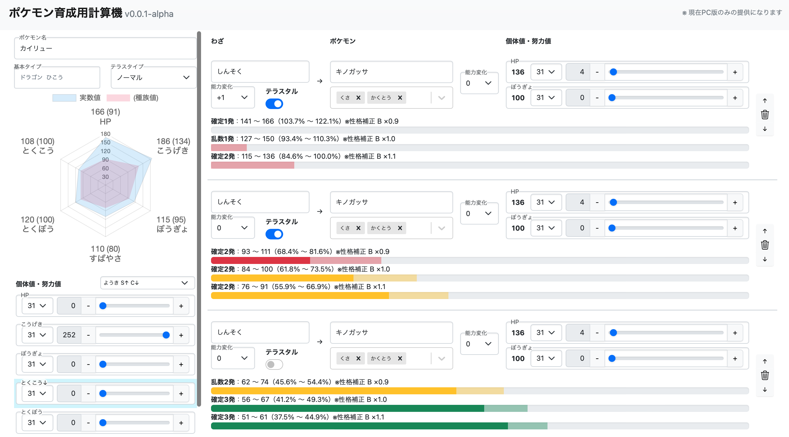

# ポケモン育成用計算機



https://pokemon-calcstats.ticktuck.tech

※ 現在、PC版のみの提供となります。スマホ版はデザイン中です  
※ 現在、鋭意制作中です

本アプリケーションをより良くするためのissueおよびPRは随時受け付けております。
README改善のみでも大変助かります

## 開発者の方へ
主に使用しているライブラリは以下になります
- [Vite](https://vitejs.dev)
- [Typescript](https://www.typescriptlang.org)
- [React](https://ja.reactjs.org)
- [Redux](https://redux.js.org)（[Redux-Toolkit](https://redux-toolkit.js.org) & [React-Redux](https://react-redux.js.org)）

```bash
$ cp envs/.env envs/.env.local
### .env.local の各値を適切なものに書き換えてください
### なお、書き換えなくても動作確認できます

$ yarn install --frozen-lockfile
$ yarn run dev
### 環境変数を整備した場合はHTTPSサーバを利用できます
$ yarn run dev:https
```

